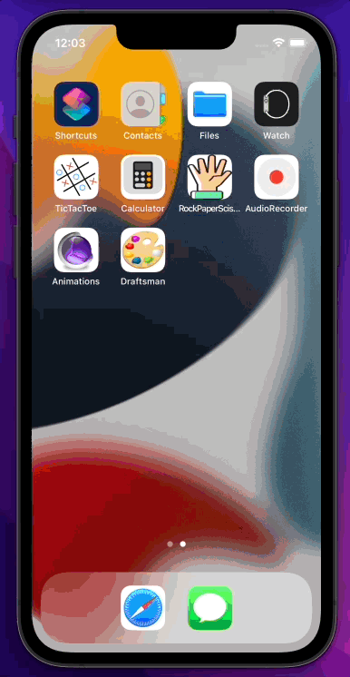
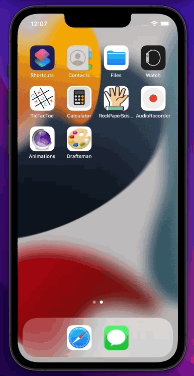
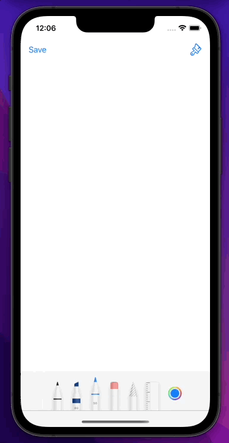

# This is Draftsman 🎨.
The Swift app made with only programmatic UI that allows users to draw/create a drawing on the device.  
Use a wide range of tools to show how your art looks like.  

## Demo of an app
   

## Description 
User can draw whatever wants and then using the left bar button save it directly to the camera roll.  
The right bar button is used for toggling toolPicker visibility.  
App uses PencilKit and PhotosUI.  
If you have any questions just send them here:   

### Saving a drawning:
  

### Toggle ToolPicker:
  

## Future improvments:
- tommorow I will add coments to the code and clean it up.
  
If you have any questions just send them here: 
   
Made with ♥️ in Swift.
